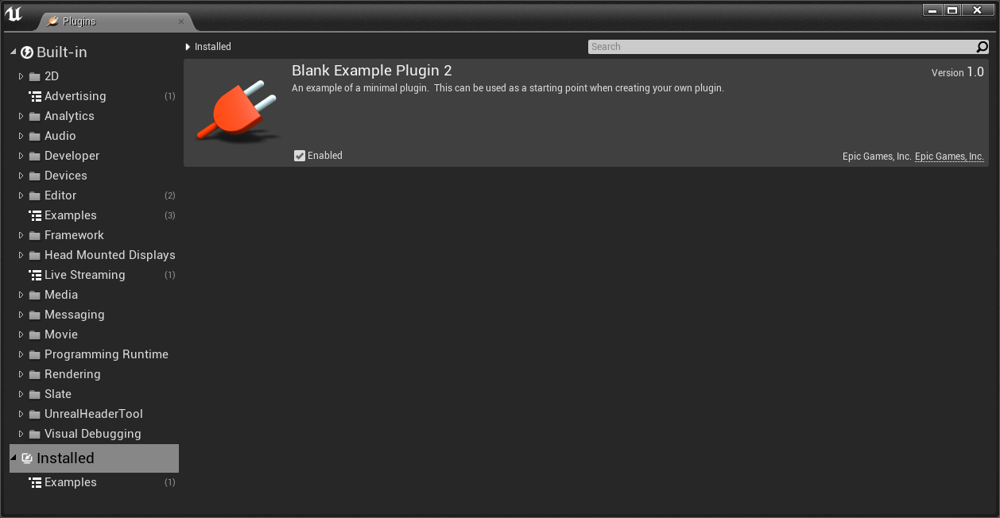

# Process for building a UE4 plugin in UE 4.5

# Install VS 2013

UE 4.5 requires [Visual Studio 2013](https://www.visualstudio.com/vs/older-downloads/)

# Install Windows 8.1 SDK

* [Microsoft: Old releases](https://developer.microsoft.com/en-us/windows/downloads/sdk-archive)


# Initial creation of the project


# Put the project on [GIT](https://github.com/tgraupmann/UE4BlankPlugin)

# Create the .gitignore for the UE4 project

* Ignore the VS files that can be regenerated

* Ignore the intermediate folder

* Ignore the binary folder

* Ignore the saved folder

* Add the source folder

# Build the project in VS 2013

```
1>  [7/7] Link UE4Editor-UE4BlankPlugin.dll
1>     Creating library C:\Public\UE4BlankPlugin\Intermediate\Build\Win64\UE4BlankPluginEditor\Development\UE4Editor-UE4BlankPlugin.lib and object C:\Public\UE4BlankPlugin\Intermediate\Build\Win64\UE4BlankPluginEditor\Development\UE4Editor-UE4BlankPlugin.exp
1>  -------- End Detailed Actions Stats -----------------------------------------------------------
1>  Cumulative action seconds (12 processors): 0.00 building projects, 49.46 compiling, 0.00 creating app bundles, 0.00 generating debug info, 2.08 linking, 0.00 other
1>  UBT execution time: 90.34 seconds
========== Build: 1 succeeded, 0 failed, 0 up-to-date, 0 skipped ==========
```

# Launch from VS 2013, Debug->Start Without Debugging (Control+F5)


#  The new project opens in the UE4 Editor


# Close the UE4 Editor

# Make a new `Plugins` subfolder

# Copy the sample BlankPlugin into the project's plugin folder

[Engine/Plugins/Developer/BlankPlugin](https://github.com/EpicGames/UnrealEngine/tree/4.5/Engine/Plugins/Developer/BlankPlugin)

# Rename folders, files and content from `BlankPlugin` to `BlankPlugin2`

```
Plugins/
Plugins/Developer
Plugins/Developer/BlankPlugin2
Plugins/Developer/BlankPlugin2/BlankPlugin2.uplugin
Plugins/Developer/BlankPlugin2/Resources
Plugins/Developer/BlankPlugin2/Resources/Icon128.png
Plugins/Developer/BlankPlugin2/Source
Plugins/Developer/BlankPlugin2/Source/BlankPlugin2
Plugins/Developer/BlankPlugin2/Source/BlankPlugin2/BlankPlugin2.Build.cs
Plugins/Developer/BlankPlugin2/Source/BlankPlugin2/Private
Plugins/Developer/BlankPlugin2/Source/BlankPlugin2/Private/BlankPlugin2.cpp
Plugins/Developer/BlankPlugin2/Source/BlankPlugin2/Private/BlankPlugin2PrivatePCH.h
Plugins/Developer/BlankPlugin2/Source/BlankPlugin2/Public
Plugins/Developer/BlankPlugin2/Source/BlankPlugin2/Public/IBlankPlugin2.h
```

# Regenerate the VS project files by right-clicking the UE4BlankPlugin.uproject and select `Generate Visual Studio project files` in the context menu


# VS will detect a change and select `Reload All`


# Build and launch from VS


# Select `YES` to build the plugin module


# When the UE4 launches, the plugin will be loaded


