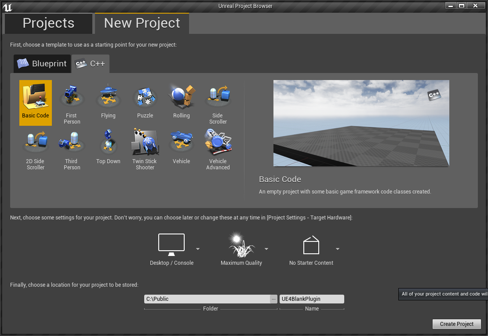
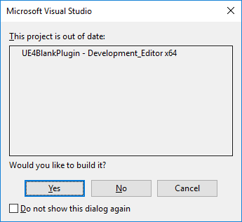
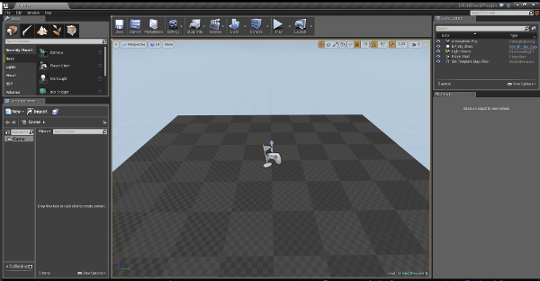
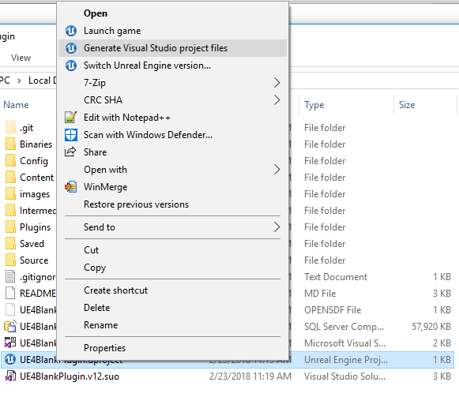
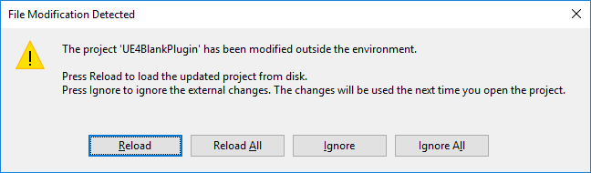
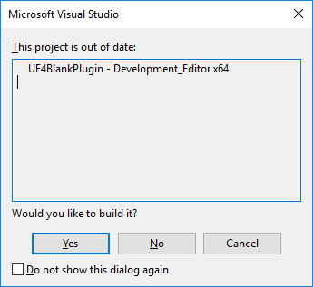
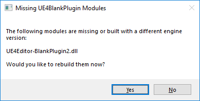
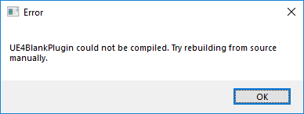
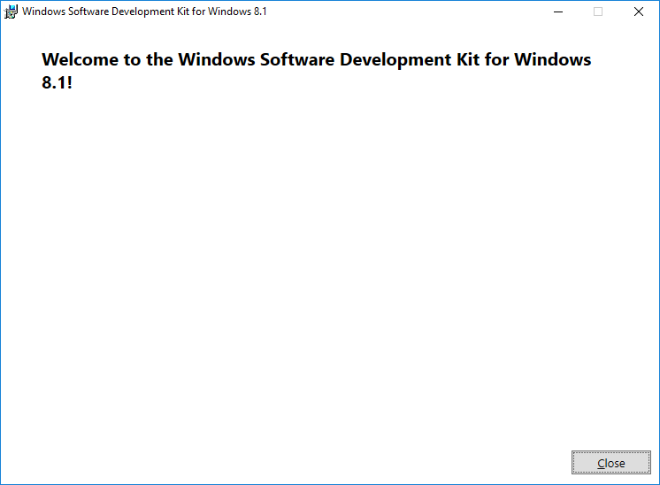

# Process for building a UE4 plugin in UE 4.5

# Initial creation of the project



# Put the project on [GIT](https://github.com/tgraupmann/UE4BlankPlugin)

# Create the .gitignore for the UE4 project

* Ignore the VS files that can be regenerated

* Ignore the intermediate folder

* Ignore the binary folder

* Ignore the saved folder

* Add the source folder

# Build the project in VS 2013

```
1>  [7/7] Link UE4Editor-UE4BlankPlugin.dll
1>     Creating library C:\Public\UE4BlankPlugin\Intermediate\Build\Win64\UE4BlankPluginEditor\Development\UE4Editor-UE4BlankPlugin.lib and object C:\Public\UE4BlankPlugin\Intermediate\Build\Win64\UE4BlankPluginEditor\Development\UE4Editor-UE4BlankPlugin.exp
1>  -------- End Detailed Actions Stats -----------------------------------------------------------
1>  Cumulative action seconds (12 processors): 0.00 building projects, 49.46 compiling, 0.00 creating app bundles, 0.00 generating debug info, 2.08 linking, 0.00 other
1>  UBT execution time: 90.34 seconds
========== Build: 1 succeeded, 0 failed, 0 up-to-date, 0 skipped ==========
```

# Launch from VS 2013, Debug->Start Without Debugging (Control+F5)



#  The new project opens in the UE4 Editor



# Close the UE4 Editor

# Make a new `Plugins` subfolder

# Copy the sample BlankPlugin into the project's plugin folder

```
C:\Program Files\Epic Games\UE_4.5\Engine\Plugins\Developer\BlankPlugin
```

# The copied layout should look like:

```
UE4BlankPlugin/Plugins/
UE4BlankPlugin/Plugins/BlankPlugin
UE4BlankPlugin/Plugins/BlankPlugin/BlankPlugin.uplugin
UE4BlankPlugin/Plugins/BlankPlugin/Resources
UE4BlankPlugin/Plugins/BlankPlugin/Resources/Icon128.png
UE4BlankPlugin/Plugins/BlankPlugin/Source
UE4BlankPlugin/Plugins/BlankPlugin/Source/BlankPlugin
UE4BlankPlugin/Plugins/BlankPlugin/Source/BlankPlugin/BlankPlugin.Build.cs
UE4BlankPlugin/Plugins/BlankPlugin/Source/BlankPlugin/Public
UE4BlankPlugin/Plugins/BlankPlugin/Source/BlankPlugin/Public/IBlankPlugin.h
```

# Rename folders, files and content from `BlankPlugin` to `BlankPlugin2`

```
UE4BlankPlugin/Plugins/
UE4BlankPlugin/Plugins/BlankPlugin2
UE4BlankPlugin/Plugins/BlankPlugin2/BlankPlugin2.uplugin
UE4BlankPlugin/Plugins/BlankPlugin2/Resources
UE4BlankPlugin/Plugins/BlankPlugin2/Resources/Icon128.png
UE4BlankPlugin/Plugins/BlankPlugin2/Source
UE4BlankPlugin/Plugins/BlankPlugin2/Source/BlankPlugin2
UE4BlankPlugin/Plugins/BlankPlugin2/Source/BlankPlugin2/BlankPlugin2.Build.cs
UE4BlankPlugin/Plugins/BlankPlugin2/Source/BlankPlugin2/Public
UE4BlankPlugin/Plugins/BlankPlugin2/Source/BlankPlugin2/Public/IBlankPlugin2.h
```

# Regenerate the VS project files by right-clicking the UE4BlankPlugin.uproject and select `Generate Visual Studio project files` in the context menu



# VS will detect a change and select `Reload All`



# Build and launch from VS



# Select `YES` to build the plugin module



# This error shouldn't happen



# Check the error log

```
Log file open, 02/23/18 11:55:01
LogInit:Display: Running engine for game: UE4BlankPlugin
LogInit:Warning: Incompatible or missing module: UE4Editor-BlankPlugin2.dll
Running C:/Program Files/Epic Games/UE_4.5/Engine/Binaries/DotNET/UnrealBuildTool.exe UE4BlankPlugin Development Win64 -project="C:/Public/UE4BlankPlugin/UE4BlankPlugin.uproject" -rocket -editorrecompile -progress
Target is up to date.
LogInit:Warning: Still incompatible or missing module: UE4Editor-BlankPlugin2.dll
LogExit: Preparing to exit.
LogModuleManager: Shutting down and abandoning module DesktopPlatform (13)
LogModuleManager: Shutting down and abandoning module TextureCompressor (12)
LogModuleManager: Shutting down and abandoning module ShaderCore (11)
LogModuleManager: Shutting down and abandoning module SlateRHIRenderer (10)
LogModuleManager: Shutting down and abandoning module OpenGLDrv (9)
LogModuleManager: Shutting down and abandoning module D3D11RHI (8)
LogModuleManager: Shutting down and abandoning module Renderer (7)
LogModuleManager: Shutting down and abandoning module Engine (6)
LogModuleManager: Shutting down and abandoning module CoreUObject (5)
LogModuleManager: Shutting down and abandoning module NetworkFile (4)
LogModuleManager: Shutting down and abandoning module StreamingFile (3)
LogModuleManager: Shutting down and abandoning module SandboxFile (2)
LogModuleManager: Shutting down and abandoning module PakFile (1)
LogExit: Exiting.
Log file closed, 02/23/18 11:56:32
```

# Building UE 4.5 from source in case that's needed to build Plugins

* Checkout the [4.5](https://github.com/EpicGames/UnrealEngine/tree/4.5) source

```
git clone -b 4.5 https://github.com/EpicGames/UnrealEngine
```

# Unpack the dependencies into the checkout folder:

```
Required_1of2.zip
Required_2of2.zip
```

# Run GenerateProjectFiles.bat

```
GenerateProjectFiles.bat
```

# Open UE4.sln

# Build `Development Editor` for `Win64`

# Wait 40 minutes...

# Built with source build with same result

```
Log file open, 02/23/18 15:26:57
LogInit:Display: Running engine for game: UE4BlankPlugin
LogInit:Warning: Incompatible or missing module: UE4Editor-BlankPlugin2.dll
Running C:/UnrealEngine/UnrealEngine_4_5/Engine/Binaries/DotNET/UnrealBuildTool.exe UE4BlankPlugin Development Win64 -project="C:/Public/UE4BlankPlugin/UE4BlankPlugin.uproject" -editorrecompile -progress
Target is up to date.
LogInit:Warning: Still incompatible or missing module: UE4Editor-BlankPlugin2.dll
LogExit: Preparing to exit.
LogModuleManager: Shutting down and abandoning module DesktopPlatform (13)
LogModuleManager: Shutting down and abandoning module TextureCompressor (12)
LogModuleManager: Shutting down and abandoning module ShaderCore (11)
LogModuleManager: Shutting down and abandoning module SlateRHIRenderer (10)
LogModuleManager: Shutting down and abandoning module OpenGLDrv (9)
LogModuleManager: Shutting down and abandoning module D3D11RHI (8)
LogModuleManager: Shutting down and abandoning module Renderer (7)
LogModuleManager: Shutting down and abandoning module Engine (6)
LogModuleManager: Shutting down and abandoning module CoreUObject (5)
LogModuleManager: Shutting down and abandoning module NetworkFile (4)
LogModuleManager: Shutting down and abandoning module StreamingFile (3)
LogModuleManager: Shutting down and abandoning module SandboxFile (2)
LogModuleManager: Shutting down and abandoning module PakFile (1)
LogExit: Exiting.
Log file closed, 02/23/18 15:27:10
```

# Install Windows 8.1 SDK

* [Microsoft: Old releases](https://developer.microsoft.com/en-us/windows/downloads/sdk-archive)


